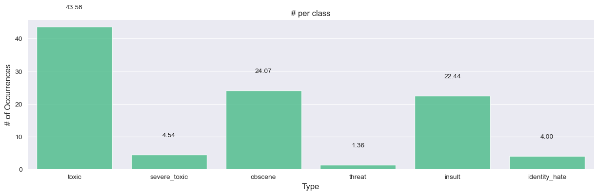
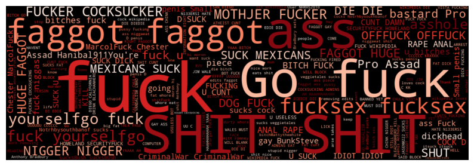

# EDA Analysis

## Insights from 001_EDA

During the exploratory data analysis (EDA), we examined the types of comments, checked for missing values, and investigated potential duplicates. A major finding was that the dataset is highly imbalanced, with a significant dominance of non-toxic comments, as shown in the following visualizations.

**Imbalance in Dataset**  

The dataset reveals varying proportions of toxicity across comments:

We also identified a large number of non-toxic comments that were not categorized, which contributed to the imbalance. These comments are not labeled as toxic.

**Multi-label Categories**  

Most comments have one, two, or three tags, with a few cases showing up to six tags:

Further analysis of the word distribution shows that around 85% of the words in the dataset are unique. Most comments have between 5 and 200 words, with the mode being around 10 words per comment. However, comments exceeding 200 words are less common.

#### Statistical Significance

We tested if the likelihood of each feature was associated in any form by applying hypothesis testing:

- **Null Hypothesis (H0):** There is no significant relationship between the variables (p-value > 5%)
- **Alternative Hypothesis (Ha):** There is a significant difference between the distributions (p-value < 5%)

Based on the results, we reject the null hypothesis. This indicates that there is a significant difference between the distributions, meaning the frequency of categories in one variable is not evenly distributed across the categories of the other variable.

## Insights from 002_EDA_Advanced

We performed additional data cleaning to filter out irrelevant or noisy data that could impact model performance:

- Total rows: 159,571
- After removing URL or HTML rows: 154,401
- Emoji conversion to words: 154,401
- Filtering comments with fewer than 512 tokens: 154,401

We also generated word clouds to visualize key terms associated with each category, helping to understand how specific words relate to toxicity:

- **Toxic**  
  
- **Severe Toxic**  
  
- **Obscene**  
  
- **Threat**  
  
- **Insult**  
  
- **Identity Hate**  
  

We also identified characters in the dataset that do not belong to the English language, likely input by users. After reviewing these comments, we determined that the primary language was English.

#### Token Distribution

We examined the distribution of token counts across comments:

- Token counts from 1 to 10: 11,164 (7.23%)
- Token counts from 11 to 50: 68,456 (44.34%)
- Token counts from 51 to 100: 37,256 (24.13%)
- Token counts from 101 to 256: 27,914 (18.08%)
- Token counts from 257 to 512: 6,740 (4.37%)
- Token counts from 513 to 999: 2,284 (1.48%)
- Token counts above 1000: 580 (0.38%)

It appears that the majority of the data contains between 11 and 256 tokens, and filtering out comments with more than 256 tokens could remove only 5% of the data. This could potentially improve model precision.

**3D Representation of Comments**  

The 3D representation of comments reveals that words, numbers, and punctuation are represented distinctly in the embedding space, suggesting groups based on their roles. Similar words, such as “since” and “from,” are clustered together, indicating that BERT captures subtle relationships between words with similar meanings.

---

### Conclusions

- The dataset is highly imbalanced, which requires attention. We will explore techniques like under-sampling, over-sampling, or using class weights to balance the dataset.
- No specific patterns were identified related to comment length or word count that could directly improve predictions. We will move on to more complex analyses.
- A total of approximately 28,000 tokens were analyzed, providing insights into word distribution.
- Several challenging words were identified in the target variables, along with some anomalous tokens (e.g., “Wikipedia”).
- We observed some characters from other languages, but these were mostly already translated. The majority of the comments are in English.
- Using dimensionality reduction techniques like PCA and t-SNE, we observed that related words clustered together in specific areas, offering a better understanding of the relationships between words and their toxicity levels.