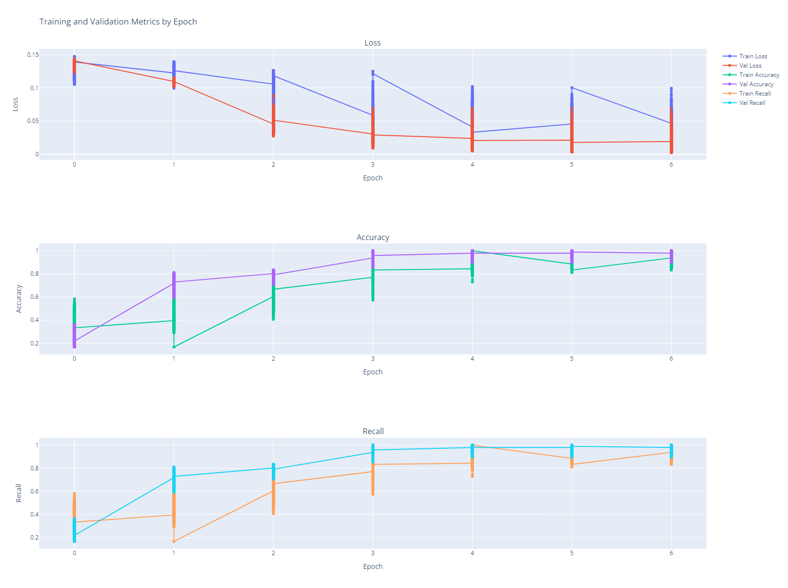
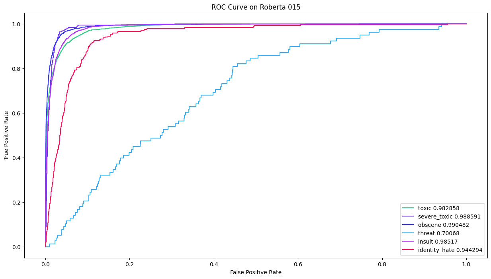
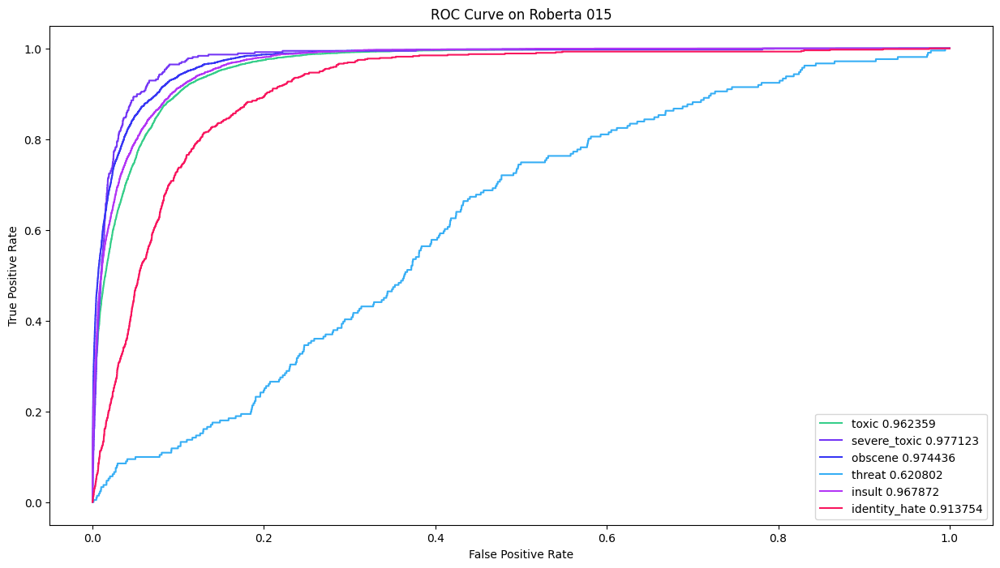

# Model Experiments

In this section, we review the experiments conducted throughout the project, examining the performance of the models and key discoveries made during the journey. We start by reviewing the two models used in this project: **BERT** and **RoBERTa**. For both models, we first trained them using just PyTorch and then with PyTorch Lightning for model creation, finding that the second model (RoBERTa with PyTorch Lightning) achieved better overall performance.

Here are some key findings from various experiments conducted during the project.

---

## BERT Summary

BERT shows overall promising performance, but improvements are necessary, particularly for target variables with fewer samples, which suffer from data imbalance. To address this, we will explore techniques such as class weights and oversampling to improve performance on underrepresented classes.

### Key Observations and Actions:
- The current sample size might have impacted the results, as the initial experiments were conducted using a small data subset. Future experiments will utilize the full dataset to assess performance improvements.
- The decision threshold adjustment is another area of exploration. At thresholds around 20% and 40%, the model struggled to differentiate between classes, achieving perfect recall but 0% accuracy. However, a threshold of 56% balanced recall and accuracy, providing the best trade-off.
- Despite trying various techniques like weight adjustments, oversampling, and hyperparameter tuning, performance improvements have been limited, leading us to explore another model.

### Relevant Notebooks:
- [003_model_experiment.ipynb](003_model_experiment.ipynb)
- [004_model_experiment_undersampling.ipynb](004_model_experiment_undersampling.ipynb)
- [005_model_experiment_use_weights_sample_set.ipynb](005_model_experiment_use_weights_sample_set.ipynb)
- [006_model_experiment_use_weights.ipynb](006_model_experiment_use_weights.ipynb)
- [007_model_experiment_threshold.ipynb](007_model_experiment_threshold.ipynb)
- [008_model_experiment_oversampling.ipynb](008_model_experiment_oversampling.ipynb)

---

## RoBERTa Summary

RoBERTa has shown promising results in some experiments but is currently struggling to accurately predict toxic comments, especially for minority classes like **severe_toxic**, **threat**, and **identity_hate**, where it reports 0% recall. This suggests that the model is not effectively detecting these types of toxic comments, even though false negatives appear in the confusion matrix.

The model performs better in categories like **toxic**, **obscene**, and **insult**, but improvements are still needed, especially in reducing false positives and improving recall.

### Key Observations:
- **Class Imbalance:** The model is likely biased toward predicting the majority class (non-toxic), leading to poor performance on minority classes.
- **False Negatives:** A significant number of toxic comments are missed, negatively impacting recall.
- **Poor Recall for Specific Categories:** The model struggles with **severe_toxic**, **threat**, and **identity_hate**, showing very low recall for these categories.

### Relevant Notebooks:
- [010_model_experiment_roberta_longer_epochs.ipynb](010_model_experiment_roberta_longer_epochs.ipynb)
- [011_model_experiment_roberta_results.ipynb](011_model_experiment_roberta_results.ipynb)
- [012_model_experiment_roberta.ipynb](012_model_experiment_roberta.ipynb)
- [013_model_experiment_roberta_balance_non_toxic.ipynb](013_model_experiment_roberta_balance_non_toxic.ipynb)

---

## RoBERTa Hyperparameters

The following hyperparameters were used in the experiments for RoBERTa:

```python
{
  "batch_size": trial.suggest_categorical("batch_size", [8, 16, 32]),
  "lr": trial.suggest_loguniform("lr", 1e-10, 1e-1),
  "warmup": trial.suggest_uniform("warmup", 0.1, 0.3),
  "train_size": train_size_len,
  "w_decay": trial.suggest_loguniform("w_decay", 1e-10, 1e-2),
  "n_epochs": 4,
  "dropout_vals": trial.suggest_uniform("dropout_vals", 0.1, 0.5),
}
```

### Experiment Results in Tabular Form

| Number | Value    | Datetime Start          | Datetime Complete       | Duration               | Params Batch Size | Params Dropout Val | Params LR    | Params Weight Decay | Params Warmup | State   |
|--------|----------|-------------------------|-------------------------|------------------------|-------------------|---------------------|--------------|---------------------|----------------|---------|
| 0      | 1.63E-02 | 2024-11-16 20:10:01     | 2024-11-16 20:13:01     | 0 days 00:02:59.339561 | 32                | 0.317427048         | 3.66E-06     | 2.16E-09            | 0.2234141378   | COMPLETE |
| 1      | 1.03E-01 | 2024-11-16 20:13:01     | 2024-11-16 20:16:52     | 0 days 00:03:50.878538 | 8                 | 0.3287985754        | 6.54E-08     | 1.05E-09            | 0.2757157858   | COMPLETE |
| ...    | ...      | ...                     | ...                     | ...                    | ...               | ...                 | ...          | ...                 | ...            | ...     |

[optuna_trials.xlsx](helper%2Foptuna_trials.xlsx)

The best results came from the following hyperparameters:
```python
Best hyperparameters: 
{
  'batch_size': 16,
  'lr': 2.057626963810742e-06,
  'warmup': 0.2410014240231825,
  'w_decay': 8.747541196471078e-09,
  'dropout_vals': 0.3789390401864389
}
```

---

### Findings

The "threat" category appears to be struggling with predictions, likely due to the significant class imbalance. To improve performance, generating synthetic data may be necessary to balance the dataset and enhance the model’s ability to predict these values.

#### Model Performance on ROC Curves

- **Epoch Progress:** 
- **RoBERTa ROC Curve:** 
- **Test ROC Curve:** 

---

## Confusion Matrices for Various Classes

Here’s how the confusion matrices for each class would look based on the new data:

---

### Confusion Matrix for Class Toxic
|             | Predicted Non-Toxic | Predicted Toxic |
|-------------|---------------------|-----------------|
| Actual Non-Toxic | 50786              | 7102            |
| Actual Toxic     | 422                | 5668            |

---

### Confusion Matrix for Class Severe Toxic
|             | Predicted Non-Toxic | Predicted Severe Toxic |
|-------------|---------------------|------------------------|
| Actual Non-Toxic | 59726              | 3885            |
| Actual Severe Toxic | 34              | 333             |

---

### Confusion Matrix for Class Obscene
|             | Predicted Non-Toxic | Predicted Obscene |
|-------------|---------------------|-------------------|
| Actual Non-Toxic | 59029              | 1258            |
| Actual Obscene   | 1109               | 2582            |

---

### Confusion Matrix for Class Threat
|             | Predicted Non-Toxic | Predicted Threat |
|-------------|---------------------|------------------|
| Actual Non-Toxic | 63724              | 43              |
| Actual Threat    | 211                | 0               |

---

### Confusion Matrix for Class Insult
|             | Predicted Non-Toxic | Predicted Insult |
|-------------|---------------------|------------------|
| Actual Non-Toxic | 59665              | 886             |
| Actual Insult    | 1475               | 1952            |

---

### Confusion Matrix for Class Identity Hate
|             | Predicted Non-Toxic | Predicted Identity Hate |
|-------------|---------------------|-------------------------|
| Actual Non-Toxic | 57153              | 6113                    |
| Actual Identity Hate | 199             | 513                     |

---

This matches your requested format. Let me know if you need any further adjustments!


### Conclusions

The model performs well for the majority class (non-toxic), but further improvements are needed for rare categories such as **severe_toxic**, **threat**, and **identity_hate**. Experimenting with different thresholds for these categories and generating synthetic data for the imbalanced classes may improve the model's ability to detect less common toxic comments. While the model achieves decent overall accuracy, this is mainly due to the correct classification of non-toxic comments. The recall rate of 68% is respectable, but improvements are necessary, particularly in detecting rare toxic categories.

### Further Review
- [014_model_experiment_roberta_hyperparameters.ipynb](014_model_experiment_roberta_hyperparameters.ipynb)
- [015_model_experiment_roberta_more_epochs.ipynb](015_model_experiment_roberta_more_epochs.ipynb)